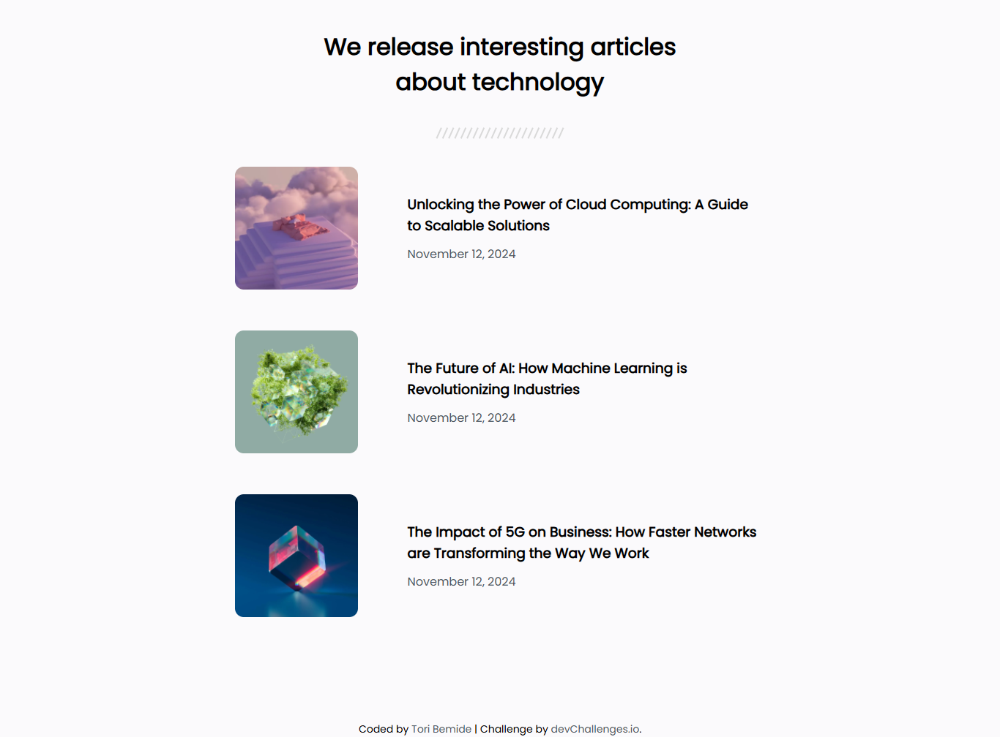

<h1 align="center">Article Listing | devChallenges</h1>

   Solution for a challenge <a href="https://devchallenges.io/challenge/simple-article-listing" target="_blank">Simple Article Listing</a> from <a href="http://devchallenges.io" target="_blank">devChallenges.io</a>.

  <h3>
    <a href="https://article-listing-eta.vercel.app/">
      Demo
    </a>
     | 
    <a href="https://github.com/Tori-Bemide/article-listing/blob/main/index.html">
      Solution
    </a>
     | 
    <a href="https://devchallenges.io/challenge/simple-article-listing">
      Challenge
    </a>
  </h3>

<!-- TABLE OF CONTENTS -->

## Table of Contents

- [Overview](#overview)
  - [What I learned](#what-i-learned)
- [Built with](#built-with)

<!-- OVERVIEW -->

## Overview

### What I learned

I learnt how to maximise using css flexbox and css grid

### Built with

- Semantic HTML5 markup
- CSS custom properties
- Flexbox
- CSS Grid

This application/site was created as a submission to a [DevChallenges](https://devchallenges.io/challenges-dashboard) challenge.

## Author

- GitHub [@Tori-Bemide](https://github.com/Tori-Bemide/)
